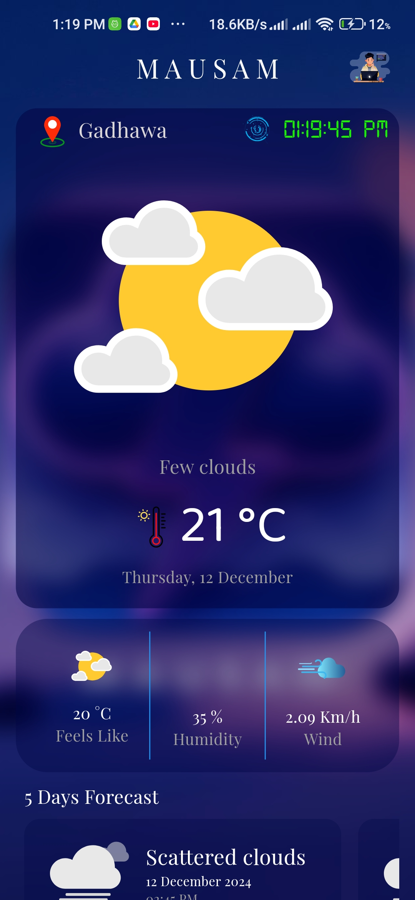
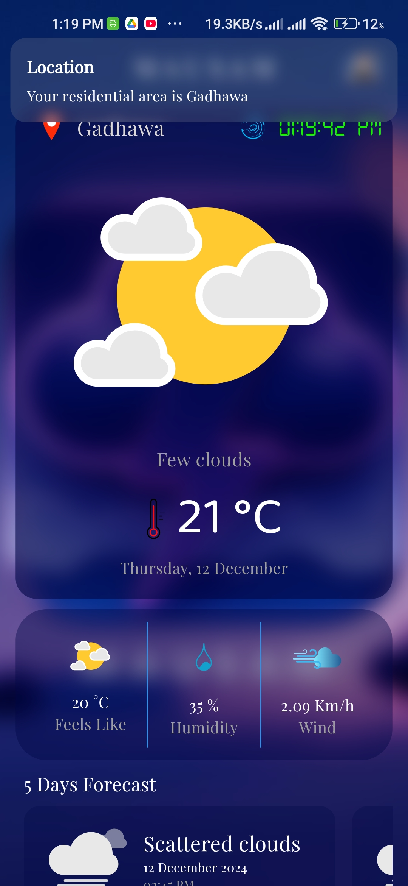

# 🌤️ Mausam

Mausam is a modern and intuitive weather app built with Flutter. It provides real-time weather updates, forecasts, and detailed information about your location or any other city around the world. With its clean UI and reliable weather data, Mausam is your go-to app for all weather-related needs.

---

## 🌟 Features

- **Current Weather**: Get accurate current weather details based on your location or by searching for a city.
- **Hourly Forecast**: View hourly forecasts for the next 24 hours.
- **Daily Forecast**: Get a 7-day weather forecast with high/low temperatures.
  <!-- - **Weather Alerts**: Receive weather warnings and updates for extreme conditions. -->
- **Location-based Updates**: Get weather information based on your GPS location.
<!-- - **Search Functionality**: Search for any city worldwide and view its weather. -->

---

## 📱 Screenshots

### Preview

<center>
<div style="display:flex;gap:20px;">



</div>
</center>

---

## 🚀 Installation

1. Clone the repository:

   ```bash
   git clone https://github.com/0sureshyadav0/mausam.git

2. Navigate to the project directory:

   ```bash
    cd mausam
   ```
3. Install dependencies:

  ```bash
    flutter pub get
  ```

4. Run the app:

  ```bash
    flutter run
  ```

## 🛠️ Technologies Used
- **Flutter**: The app framework.
- **Dart**: Programming language.
- **HTTP Package**: For making API requests to fetch weather data.
- **Geolocator Package**: For fetching user’s current location.
- **Provider Package**: For state management.

---

## 📂 Project Structure
```
mausam/
├── lib/
│   ├── screens/
│   │   ├── home_screen.dart
│   │   ├── weather_details_screen.dart
│   ├── models/
│   │   └── weather_model.dart
│   ├── providers/
│   │   └── weather_provider.dart
│   └── main.dart
├── assets/
│   ├── images/
│   │   └── icon.png
└── pubspec.yaml
```
---

## 📄 License
This project is licensed under the MIT License. See the LICENSE file for details.

--

## 🧑‍💻 Developer
Suresh Yadav
- 🌐 [sureshyadav.info.np]

---

## 🙌 Contribution
Contributions are welcome! Feel free to open an issue or submit a pull request.

---

## 📞 Support
For any issues or feedback, contact Suresh Yadav.

---

Stay updated with the weather using Mausam! 🌦️

